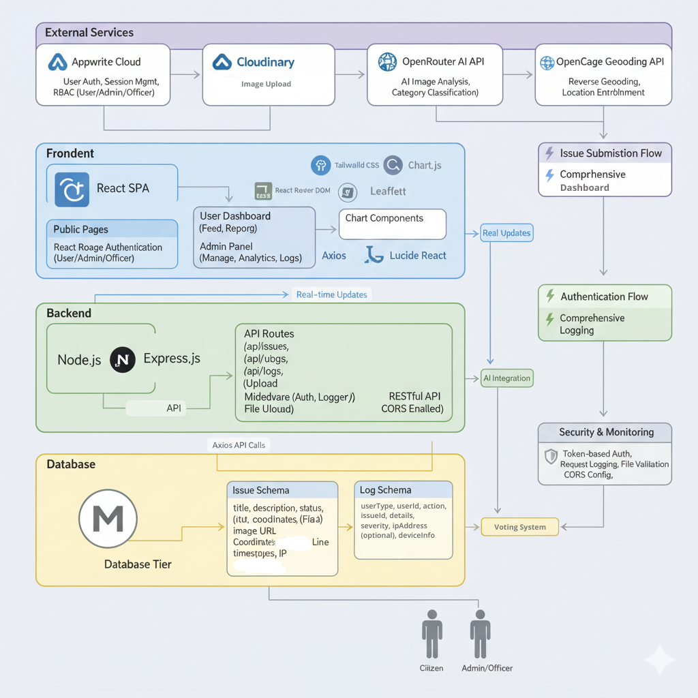

<div align="center">
  

  # 🏙️ NagarSeva
  **Aapki Awaaz, Shaher ka Vikas.**

  *AI-Powered Hyperlocal Civic Issue Reporting and Resolution Platform*

  *Empowering citizens with AI and real-time civic governance.*
  
  [](https://opensource.org/licenses/MIT)
  [](https://reactjs.org/)
  [](https://nodejs.org/)
  [](https://mongodb.com)

  [Live Demo](#-live-deployment) • [Features](#-core-features) • [Architecture](#-system-architecture) • [Deployment](#-deployment) • [Directory Tree](#-directory-structure) • [Installation](#-quick-setup) • [API Reference](#-api-endpoints)
</div>

---

## 🔴 Live Deployment

- **Frontend**: https://vibe2ship-11096.web.app
- **Repository**: https://github.com/Aryan-coder06/NagarSeva

---

## 🎯 Problem Statement

Communities frequently face issues such as potholes, water leakages, damaged streetlights, waste management concerns, and public infrastructure challenges. Reporting these issues is often fragmented, difficult to track, and lacks transparency.

## ⚔️ Challenge

Build a platform that enables citizens to identify, report, validate, track, and resolve community issues through collaboration, data, and intelligent automation.
The solution should encourage transparency, accountability, and community participation.


## 💡 The Solution: NagarSeva

**NagarSeva** is a comprehensive, full-stack web application that bridges the gap between citizens and municipal governance.

By leveraging **GPS-tagged locations**, **Cloudinary multimedia handling**, and **Google Gemini AI** for automatic categorization and severity assessment, NagarSeva transforms civic reporting into a seamless report-to-resolution workflow. The platform features interactive community maps, live status tracking, administrative dashboards, and a community authenticity system that helps crowd-source priority and trust.

This project was built for the **Community Hero - Hyperlocal Problem Solver** hackathon problem statement with a strong emphasis on:

- real civic reporting workflows
- citizen verification and municipal accountability
- agentic AI-assisted triage and routing
- Google technology usage in production deployment
- a usable dual-portal product experience

---

## ✨ Core Features

### 👨‍👩‍👧‍👦 For Citizens
- **📸 Image and Video Reporting**: Upload an image or video. GPS auto-detects the location while AI analyzes the report to classify the issue and gauge severity.
- **🗺️ Interactive Live Map**: Visualize reported issues across your city with status pins, category filters, and locality-aware civic context.
- **🗳️ Community Authenticity & Verification**: Citizens can confirm, flag false, or mark duplicates. Trust score and verification state are derived from structured community input.
- **🎮 Gamification & Citizen Tiers**: Engage citizens with a gamified progression ladder (Jagruk, Nagar Sathi, Prahari, to Karmayogi). Unlock higher tiers by maintaining streaks, driving community validations, and seeing issues resolved.
- **💰 Government Cashback & Rewards**: Incentivize civic participation! Citizens can earn monthly monetary rewards (from ₹100 up to ₹10,000) based on their active citizen tier level.
- **🏅 Badges & Hero Score**: Earn achievement badges (Pulse, Civic50, Wardwatch) and build up a "Hero Score" that quantifies real-world civic impact.
- **🏆 Civic Leaderboard**: Track top-performing citizens and view your ranking across the local community to foster healthy civic competition.
- **🔄 Live Tracking**: Follow the issue from reporting to municipal review, assignment, escalation, and resolution.
- **🔔 In-App Notifications & SMTP Email Alerts**: Users now receive local notification feed updates and branded HTML emails when reports are created, routed, assigned, escalated, reviewed for authenticity, or resolved.
- **🎙️ Voice & AI Assistant**: Use voice reporting powered by Sarvam AI and interact seamlessly with the local Luna assistant for quick queries.
- **🎬 GeminiFlow Explainer**: Homepage MP4 explainer and timed intro video communicate the AI route from citizen evidence to municipal execution.

### 🏛️ For Municipal Authorities
- **🤖 AI-Powered Triage**: Gemini classifies category, issue type, severity, urgency, suggested department, and operational summaries.
- **📊 Analytics Dashboard**: Visualize departmental performance, resolution rates, and municipal issue mix with scoped dashboards.
- **👮 Officer Assignment & Escalation**: Dispatch field officers, set due dates, escalate stuck cases, and maintain an action timeline.
- **🔍 Duplicate Detection**: Detect duplicate reports within a 250m radius to reduce redundant workflows and consolidate evidence.
- **📈 Priority Engine**: Priority is derived from AI severity, urgency, community confirmation, issue age, and duplicate clustering.
- **✅ Authenticity Decision Layer**: Community signals shape trust, but municipality makes the final approve / reject / duplicate decision.

### 🎮 Gamification & Engagement Engine
NagarSeva utilizes a robust progression and reward system to keep citizens actively involved in community improvement:
- **Progression Ladder**: Citizens climb through four dedicated civic tiers: **Level 1 (Jagruk)**, **Level 2 (Nagar Sathi)**, **Level 3 (Prahari)**, and finally the legendary **Level 4 (Karmayogi)**. Climbing is based on reporting activity, streak days, validations, and the number of reports that actually get resolved by authorities.
- **Government Cashbacks**: A structured reward pool (₹100 to ₹10,000 monthly) incentivizes continuous and verifiable civic reporting, converting civic duty into tangible rewards.
- **Civic Leaderboard & Hero Score**: The platform quantifies real-world impact through a transparent "Hero Score", celebrating the most active and reliable community members on a public leaderboard.
- **Badge System**: Specific actions unlock unique badges (e.g., *Wardwatch* for local clustering, *Civic50* for streaks, and *Fixloop* for confirmed resolutions), creating a highly engaging user loop.

### 🎨 UI/UX & Integrations
- **Dark/Light Mode**: Full responsive theming with custom toggle components to fit user preferences.
- **Rich Interactive Animations**: Built with `Framer Motion`, featuring smooth page transitions, animated counters, motion cards, and interactive civic dashboards.
- **Geospatial & Media APIs**: Seamless integration with **OpenCage** for accurate reverse geocoding (turning coordinates into addresses) and **Cloudinary** for scalable, robust image/video handling.

---

## ✅ What Is Implemented Today

NagarSeva currently delivers the following working product surface:

- citizen signup/login with Firebase Authentication
- municipal signup/login with separate portal gating
- citizen onboarding with India-first locality details
- municipality onboarding with department, designation, jurisdiction, and scoped categories
- image and video issue reporting
- voice-to-text report drafting with Sarvam STT
- Gemini-powered issue triage:
  - category
  - issue type
  - severity
  - urgency
  - suggested department
  - public summary
  - authority summary
  - recommended action
- reverse geocoding from coordinates to city/state
- duplicate detection using location radius + text overlap
- public issue map and community queue
- citizen authenticity votes: confirm / false / duplicate
- municipal authenticity decision: approved / rejected / duplicate
- officer assignment, due dates, escalation, and status timeline
- citizen dashboard with:
  - issue map
  - activity pulse
  - hero score
  - badge system
  - leaderboard progression
  - level rewards
- public leaderboard and community engagement views
- in-app notifications + branded email notifications
- production deployment on Firebase Hosting + Google Cloud Run

---

## 🤖 Agentic Depth

NagarSeva’s current agentic core is not a chatbot wrapper. It is a structured operational workflow:

1. **Evidence ingestion**
   - user uploads image/video or drafts via voice transcription
2. **AI triage**
   - Gemini analyzes the report and outputs structured civic metadata
3. **Geo-context enrichment**
   - OpenCage derives city/state from raw coordinates
4. **Duplicate reasoning**
   - nearby unresolved issues are checked using geospatial distance and text overlap
5. **Priority scoring**
   - severity, urgency, trust, votes, duplicates, and age combine into a municipal priority score
6. **Community verification loop**
   - citizens contribute authenticity signals
7. **Municipal action routing**
   - scoped dashboards only surface relevant issues by geography and category
8. **Stateful notifications**
   - workflow transitions trigger in-app alerts and HTML emails

This is the present production-grade orchestration layer. A future LangGraph/LangChain refactor remains optional expansion, not a fake claim.

---

## ☁️ Google Technology Usage

To align with the hackathon’s evaluation criteria, NagarSeva actively uses Google technologies in the current build:

- **Google Gemini API / Google AI Studio**
  - structured issue triage and civic summarization
- **Google Cloud Run**
  - backend deployment
- **Firebase Authentication**
  - citizen and municipal authentication
- **Firebase Hosting**
  - production frontend deployment

This gives the project a real Google-backed deployment and inference stack instead of a superficial API demo.

---

## 🛠️ Technology Stack

| Layer | Technologies |
| :--- | :--- |
| **Frontend** | React 19, Vite, Tailwind CSS v4, Framer Motion, Leaflet Maps, Chart.js, Lucide Icons, MP4 explainer UI |
| **Backend** | Node.js, Express 5.1.0, Mongoose, CommonJS |
| **Database** | MongoDB |
| **Authentication**| Firebase Auth (Client SDK + Admin token verification) |
| **AI Engine** | Google Gemini API (`gemini-2.5-flash-lite` with `gemini-2.5-flash` fallback) |
| **Speech & AI Assist** | Sarvam Speech-to-Text, Local Luna assistant |
| **Media & APIs** | Cloudinary (Images/Video), OpenCage (Reverse Geocoding) |
| **Notifications** | In-app notification feed + SMTP email delivery with branded HTML templates |
| **Deployment Target** | Google Cloud Run (backend), Firebase Hosting (frontend) |

---

## 📂 Directory Structure

Here is the high-level architecture of the NagarSeva mono-repo:

```text
NagarSeva/
├── <b>.github/</b>                 # Issue & PR Templates
├── <b>docs/</b>                    # Architecture diagrams and Build plans
├── <b>backend/</b>
│   ├── <b>controllers/</b>         # Core business logic (IssueControl.js, logControl.js, etc.)
│   ├── <b>models/</b>              # Mongoose schemas (Issue, Log, Officer, UserProfile)
│   ├── <b>routes/</b>              # Express API route definitions
│   ├── <b>middleware/</b>          # RBAC (Auth) and auto-logging middlewares
│   ├── <b>utils/</b>               # AI integration (analyseImage) & Geocoding
│   ├── <b>lib/</b>                 # Firebase Admin initialization
│   ├── <b>scripts/</b>             # Database seeders
│   ├── index.js             # Express application entry point
│   └── package.json         # Backend dependencies
├── <b>frontend/</b>
│   ├── <b>src/</b>
│   │   ├── <b>api/</b>             # Axios API service wrappers
│   │   ├── <b>components/</b>      # Reusable UI components (Public, Admin, Municipal)
│   │   ├── <b>contexts/</b>        # React Context providers (AuthContext)
│   │   ├── <b>data/</b>            # Static JSON/JS datasets
│   │   ├── <b>pages/</b>           # Route-level components (Dashboard, About, VotingSystem)
│   │   ├── <b>utils/</b>           # Frontend helpers (Cloudinary uploads)
│   │   ├── <b>assets/</b>          # Media and SVGs
│   │   ├── App.jsx          # Primary Router configuration
│   │   └── main.jsx         # React DOM entry
│   ├── tailwind.config.js   # Tailwind design tokens
│   └── vite.config.js       # Vite bundler configuration
└── <b>README.md</b>
```

---

## 🏗️ System Architecture



The application utilizes a decoupled client-server architecture. The React frontend handles mapping, citizen and municipal portal UX, and authenticated issue workflows, communicating via Firebase-backed Bearer tokens to the Express backend. The backend orchestrates MongoDB persistence, Gemini AI inference, Cloudinary media uploads, and OpenCage geospatial enrichment.

---

## 🧠 AI Workflow

Every report moves through a structured AI-assisted pipeline:

1. **Citizen submits report** with image/video + location
2. **Gemini triage** generates category, issue type, severity, urgency, department, and summaries
3. **Duplicate detection** checks nearby unresolved reports
4. **Community authenticity** collects confirm / false / duplicate votes
5. **Trust score** and verification status are derived from community signals
6. **Municipal decision** approves, rejects, or marks duplicate
7. **Assignment and escalation** drive officer-side resolution
8. **Notification fan-out** updates citizens and scoped municipal users through in-app alerts and SMTP email

This is the current implemented agentic core of NagarSeva.

---

## 🧭 Expansion Roadmap

These are the next justified upgrades for a larger production version of NagarSeva:

### LangGraph + LangChain
- **LangChain** for model/tool abstractions and structured civic tools
- **LangGraph** for a durable civic workflow graph:
  - triage
  - duplicate check
  - trust evaluation
  - routing
  - municipal action recommendations

This is the right path if we want stronger long-running agent workflows, human-in-the-loop review, and richer observability.

### Google Cloud / GCP
- **Vertex AI / Gemini on Google Cloud** for enterprise-grade model routing
- **Cloud Storage** for media instead of third-party object storage
- **BigQuery** for hotspot analytics and predictive civic insights
- **Cloud Scheduler** for automated streak reminders and daily municipal digests

We have not claimed these as implemented yet. They are the practical next platform upgrades.

---

## 🚢 Deployment

### Stack and Entrypoint

- **Runtime**: Node.js on Google Cloud Run
- **App entrypoint**: [backend/index.js](./backend/index.js)
- **Start command**: `npm start`
- **Container port**: `process.env.PORT`
- **Bind host**: `0.0.0.0`

The current recommended production deployment path is:

- **Frontend**: Firebase Hosting
- **Backend**: Google Cloud Run
- **Auth**: Firebase Authentication
- **AI**: Gemini API via Google AI Studio
- **Database**: MongoDB Atlas

Detailed deployment instructions live in:

- [docs/GCP_DEPLOYMENT.md](./docs/GCP_DEPLOYMENT.md)

This keeps the current codebase intact while satisfying the hackathon requirement that the deployed app run on Google Cloud.

### Cloud Run Deploy

Deploy the backend from the `backend/` directory:

```bash
cd backend
gcloud run deploy hackathon-app --source . --region asia-south1 --allow-unauthenticated --set-env-vars GEMINI_API_KEY=your_gemini_key
```

For a real deploy, also provide the other required runtime environment variables from [backend/.env.example](./backend/.env.example), especially:

- `MONGODB_URI`
- `FIREBASE_PROJECT_ID`
- `FIREBASE_CLIENT_EMAIL`
- `FIREBASE_PRIVATE_KEY`
- `FRONTEND_ORIGIN`
- `CLOUD_NAME`
- `CLOUD_API_KEY`
- `CLOUD_API_SECRET`
- `OPENCAGE_API_KEY`
- `SARVAM_API_KEY`

If `gcloud` returns **Billing account is not open**, stop there. Billing must be enabled in Google Cloud Console before Cloud Run can be deployed.

---

## 🚀 Quick Setup

### Prerequisites
- Node.js (v18+ recommended)
- MongoDB (Local or Atlas)
- Firebase Project (Web & Service Account)
- Cloudinary Account
- Google Gemini API Key

### 1. Backend Configuration
```bash
# Clone the repository
git clone https://github.com/Aryan-coder06/NagarSeva.git
cd NagarSeva/backend

# Install dependencies
npm install

# Setup environment variables
cp .env.example .env
```
*Populate `.env` with your MongoDB URI, Firebase Service Account keys, Cloudinary credentials, Gemini API key, and OpenCage key.*
Also add SMTP credentials if you want real email delivery locally. Without SMTP envs, the in-app notification feed still works.
For daily streak reminder emails, run:

```bash
cd backend
npm run notify:streaks
```

```bash
# Start the backend development server
npm run dev
```

### 2. Frontend Configuration
```bash
# Open a new terminal and navigate to frontend
cd ../frontend

# Install dependencies
npm install

# Setup environment variables
cp .env.example .env
```
*Populate `.env` with your Vite backend URL and Firebase Web configuration.*

```bash
# Start the frontend development server
npm run dev
```

Access the **Frontend** at `http://localhost:5173` (or the next Vite port if occupied) and the **Backend API** at `http://localhost:3000`.

---

## 📡 API Endpoints (Backend)

NagarSeva provides a RESTful API secured by Firebase bearer token verification.

### Issues (`/api/issues`)
- `GET /api/issues` - Fetch public issues (supports pagination, geospatial filtering)
- `GET /api/issues/all` - Fetch all issues (Municipal access)
- `POST /api/issues` - Submit a new report (Triggers Gemini AI)
- `PATCH /api/issues/:id/status` - Update issue resolution status (Municipal)
- `POST /api/issues/:id/vote` - Cast authenticity vote: confirm / false / duplicate
- `PATCH /api/issues/:id/decision` - Municipal final authenticity decision
- `PATCH /api/issues/:id/assign` - Assign issue to an officer
- `PATCH /api/issues/:id/escalate` - Escalate an issue in municipal workflow

### Analytics & Logs (`/api/logs`)
- `GET /api/logs` - Fetch audit logs for system events
- `GET /api/logs/stats` - Fetch aggregate metrics for dashboards

### Users, Notifications & Officers (`/api/profile`, `/api/notifications`, `/api/officers`)
- `GET /api/profile/me` - Fetch current user's profile
- `PUT /api/profile/me` - Create or update citizen / municipal profile
- `GET /api/notifications/me` - Fetch in-app notifications and unread count
- `PATCH /api/notifications/:id/read` - Mark one notification as read
- `PATCH /api/notifications/me/read-all` - Mark all notifications as read
- `POST /api/officers` - Register a new municipal field officer

---

## 📈 Evaluation Fit

How NagarSeva maps to the hackathon evaluation matrix:

- **Problem Solving & Impact**
  - closes the loop from citizen evidence to municipal action
- **Agentic Depth**
  - structured AI triage, duplicate reasoning, trust loop, routing, and notifications
- **Innovation & Creativity**
  - dual-portal civic workflow + gamified participation + municipal scoping
- **Usage of Google Technologies**
  - Gemini API, Firebase Auth, Firebase Hosting, Cloud Run
- **Product Experience & Design**
  - polished dark/light UI, dual portals, live maps, leaderboard, badge ladder
- **Technical Implementation**
  - full-stack production deployment, role-aware routing, AI-assisted issue lifecycle
- **Completeness & Usability**
  - live deployed app, repository, dual-portal flow, reporting to resolution

### AI Utilities (`/api/ai`)
- `POST /api/ai/transcribe` - Transcribe citizen audio input with Sarvam STT

---

## 🔗 Reference Docs

- [LangGraph overview](https://docs.langchain.com/oss/javascript/langgraph/overview)
- [LangChain overview](https://docs.langchain.com/oss/javascript/langchain/overview)
- [Google Cloud Run Node.js quickstart](https://cloud.google.com/run/docs/quickstarts/build-and-deploy/deploy-nodejs-service)
- [Google Cloud Vertex AI Node.js reference](https://cloud.google.com/nodejs/docs/reference/vertexai/latest)

---

## 🤝 Contributing

We welcome contributions to make NagarSeva better! 
1. Fork the repository
2. Create your feature branch (`git checkout -b feature/AmazingFeature`)
3. Commit your changes (`git commit -m 'Add some AmazingFeature'`)
4. Push to the branch (`git push origin feature/AmazingFeature`)
5. Open a Pull Request

Please review our [CONTRIBUTING.md](./CONTRIBUTING.md) and [CODE_OF_CONDUCT.md](./CODE_OF_CONDUCT.md) for detailed guidelines.

---

## 📜 License

Distributed under the MIT License. See [`LICENSE`](./LICENSE) for more information.

<div align="center">
  <i>Built with passion for smarter, cleaner cities.</i>
</div>
